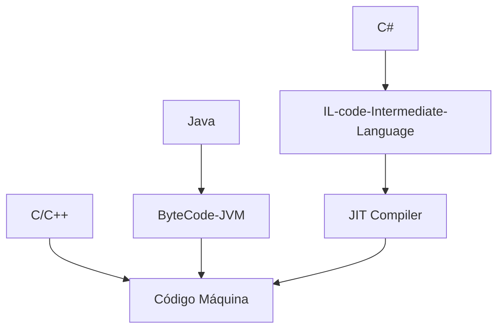

# .NET Framework

Es un framework que permite desarrollar apps en windows, proporciona un entorno en el cual las computadoras pueden correr programas.
Su composicion se subdivide en :
- **Assemblies** : Los cuales son tipicamente archivos con formato `.exe` o `.dll`  que contienen codigo compilado el cual requiere de .NET para ser ejecutados.
- **The Common Language Runtime (CLR)** : Este es un conjunto de librerias de windows el cual su trabajo es correr los Assemblies. Es esencialmente una maquina virtual.
- **Class libraries** : Vendrian a ser un conjunto de APIs orientada a objetos las cuales pueden ser utilizadas por los Assemblies.
 
Los lenguajes más comunes que utilizan .NET son C# y VB.NET.

Respecto a la compatibilidad, en el caso del framework .NET, se ejecutada en "cualquier" version de windows y para el framework .NET CORE en "cualquier" dispositivo moderno; es decir, tiene soporte de ejecucion multiplataforma.
 

### CLR

Se trata de una aplicación en memoria cuyo trabajo consiste en traducir código IL (lenguaje intermedio) a código máquina, es decir, JIT (compilación justo a tiempo).
 

### .dll

Básicamente un modulo; es decir, una coleccion de codigo reutilizable para que otros programas lo llamen.
 
### .bat

Es un archivo script, se podria decir que es el equivalente a un script bash o .sh en Linux
 
### Class Library

Las aplicaciones se componen de clases.  

Las clases relacionadas se organizan en contenedores llamados Namespaces.  

Los namespaces se organizan en un ensamblado, ya sea un EXE (ejecutable) o una DLL (biblioteca vinculada dinámicamente).

Cuando se compila la aplicación, se crean uno o más Ensamblados.

# Para Development

1. .NET contiene un gran conjunto de programas a los cuales puedes hacer llamadas en tu programa. Las librerías .NET son tan vastas que puedes programar Robots/Arduino, análisis de imágenes, aplicaciones web, etc.

2. Mantiene un lenguaje común por debajo y te permite programar en diferentes lenguajes de alto nivel como C#, VB, IronPython etc. Cuando se compila se convierte a un lenguaje común.   
 

# Para el usuario final

El framework .NET es requerido en el ordenados del usuario final para poder ejecutarse. 
El usuario final que instala el framework .NET no cuenta con las herramientas de compilacion, construccion o desarrollo de .NET ya que no son necesarias en este caso. 
 