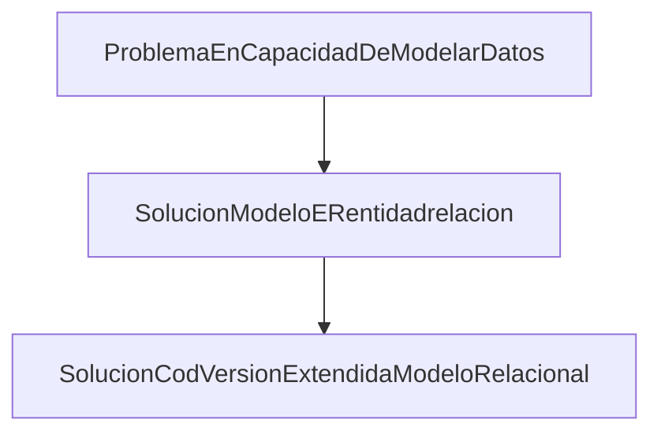
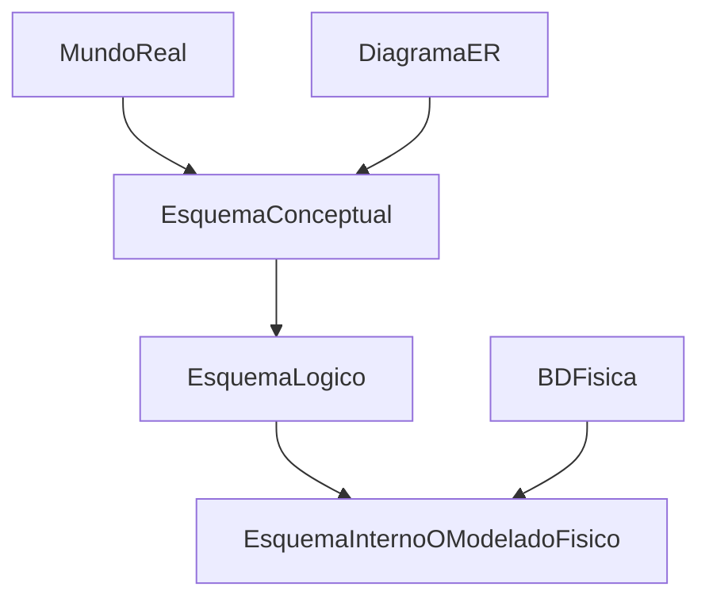
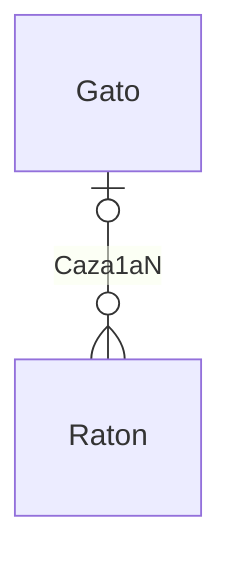
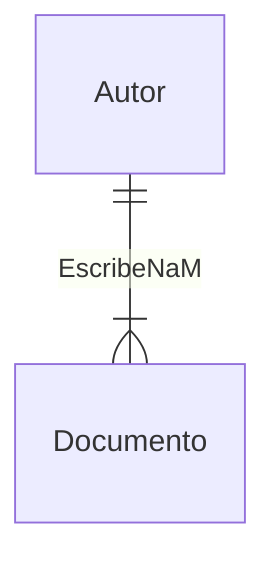

- Apuntes pdf Universidad Veracruzana
# Introduccion
 

## DBMS

El sistema de gestión de bases de datos (DBMS) fue diseñado para resolver los problemas existentes en los sistemas de procesamiento de archivos (File Processing Systems):

- **Datos separados**: Compartición de datos
- **Duplicación de datos**: Inconsistencia de datos
- **Dependencia de los datos**: Ineficiencia en los procesos
 
## SQL
La interacción entre el cliente y la base de datos es la siguiente:

Usuarios -- Aplicación de Base de Datos -- SQL -- SGBD (Sistema de Gestión de Bases de Datos) -- Base de Datos
### Database Definition Language DDL

- CREAETE
- ALTER
- DROP
- TRUNCATE
- COMMENT
- RENAME

### Data Manipulation Language DML

- SELECT
- INSERT
- UPDATE
- DELETE
- MERGE - UPSERT
- CALL
- EXPLAIN PLAN
- LOCK TABLE

## Database

What are inside a relational database

- **User Data**: Formally, a relational database represents data as **relation**;it stores user data in **tables**
- **Metadata**(or Data Dictionary):It describes the **structure** of a database and the **format** of data(A database is self-describing collection of integrated tables)
- Index: It is used to improve the performance and accessibility of the databse

### Database Development Process

- **Conceptual Data Modeling**: use data requirements and produces entity relationship diagrams(ERDs)
- **Logical database design**:transforms the conceptual data model into a format understandable by a commercial DBMS.
  - Conversion/transformation: transform ERDs into table designs
  - normalization: remove redundancies in a table design using constraints or dependencies among columns

# Relational Model

## Basic Elements

- **Key (candidata)**: **an attribute** or **a combination of attributes** that **uniquely identifies each row** in a relation.
- **Primary key**: the candidate key that is chosen as the **principal means** of identifying entity instances.
- **Foreign  key**: **an attribute** or **a combination of attributes** in a relation that serves as the primary key of another relation.(**An attribute can be both a foreign key and. also part of the primary key.**)
- **Integrity Rule/Constraint**
  - **Entity Integrity Rule/Constraint**: To ensure every relation **has a primary key(UNIQUE)** and data values for **primary are all valid(NOT NULL)**.
  - **Regerential Integrity Rule/Constraint**: if there. is a foreign key in one relation, either each foreign key value must match a primary key value in another relation or the foreign key value must be NULL.
    - Mandatory relationship: foreign. key can not be NULL
    - Optional: foreign. key can be NULL

## Conversion fron ERD to Table Design

### (Strong) Entity Type Rule

this rule use first

- entity type -- table
- entity. Attributes -- table attributes
- identifier -- primary key

### 1-M Relationship Rule

- **1-M relationship** becomes **a foreign key** in the table corresponding to the child entity type.
- This is to include the **primary key** of the table on the **one-side** of the relationship as a **foreign key** in the table on the **many-side** of the relationship.
 

### M-M Relationship Rule

- Each **M-N relationshop** beacomes **a new table** with **a combined primary key** consisting of the **primary keys of the two participating entity types.**
- The **primary key** of each participating entity type beacomes a **foreign key in the new table**
 

### Identification Dependency Rule

- The primary key of the table corresponding to the associative(weak) entity consists of :
  - The underlined local key (if any) in the weak entity 
  - the primary keys of the entity types connected by identifying relationship
- The primary keys for the participating entity types are included as **foreign keys of the associative table**

### Weak Entity Type Rule

- For each **weak entity type**, create **a new table** and include all of the attributes as attributes of this relation(weak entity -- table)
- The **primary key** of the new table is the **combination** of the **primary key of the owner** and the **partial identifier of the waeak entity type** if any.(primary key + (partial identifier) -- primary key)
- Then include the **primary key of the strong entity type** it depends on as **a foreign key** in this new table(primary key -- foreign key)
 

### Optional 1-M Relationship Rule

- Each such optional 1-M relationship can be **converted into a table instead of a foreign key** (optional 1-M relationship --- table)

- The **primary key of the new table** is the **primary key** of the entity type on the **many-side** of the relationship.(**primary key on the M-side --> primary key**)

- The new table contains **foreign keys** for the **primary keys** of the both entity types participating in the relationship (**primary keys --> foreign keys**)

- Both foreign keys in the new table do not permit **NULL** values.

  - **Avoid NULL values in foreign keys, result in more tables, query execution can be slower.** 

    The choice of using this rule in place of 1-M relationship rule **depends on the importance of avoiding null values versus avoiding extra tables.** In many databases, avoiding extra tables may be more important than avoiding null values.

### 1-1 Relationship Rule

- –1-1 relationships can be viewed as a special case of 1-M relationships, i.e., **the 1-1 relationship is converted into a foreign key.** 
- **Two tables are created for two entity types.**
- The primary key of one of the tables is included as a foreign key in the other table.
- If the relationship is **optional** with respect to one of the entity types, **include the foreign key in the table on the optional side (to eliminate NULL values).**

 

#  Antecesores de los sistemas de Bases de datos
**Todo empieza con** los sistemas de ficheros, **los cuales son** un conjunto de programas que prestan servicio a los usuarios finales, en donde cada uno de esos programas define y maneja sus propios datos.

**Por su parte,** estos sistemas **se caracterizan por** surgir al tratar de computarizar el manejo de archivadores manuales y contar un modelo descentralizado **; es decir,** cada departamento de la empresa que hace uso del sistema almacena y manipula su propia información

	
Ejemplo de empresa inmobiliaria.
Imaginemos una empresa inmobiliaria y hagamonos **las siguientes preguntas :** 
1. ¿Cuáles son los departamentos de la empresa?
2. ¿Qué ficheros maneja cada departamento?
3. ¿Qué ficheros se encuentran repetidos en qué departamentos?
4. ¿Cuáles son los inconvenientes de los ficheros?

De acuerdo al caso de estudio, se deducen cinco inconvenientes principales:
1. Separación y aislamiento de los datos. 
2. Duplicación de datos.
3. Dependencia de datos.
4. Formatos de ficheros incompatibles. 
5. Consultas fijas y proliferación de programas de aplicación.

¿A qué se deben estos inconvenientes?
 
❑ La definición de los datos está codificada dentro de los programas de aplicación, en lugar de estar almacenada de forma independiente repercutiendo en la independencia de datos e integridad de la información.
❑ El único control sobre el acceso y manipulación
de los datos es la definida dentro de los programas de aplicación, desencadenando así consultas fijas y proliferación de programas de aplicación.
 
**Esta es la razón por la que** surgieron las bases de datos (BD) y los Sistemas de Gestión de Bases de Datos (SGBD)
**Es decir,** fueron diseñadas para satisfacer las necesidades de almacenamiento y manipulación de información de empresas, organizaciones e instituciones.

¿Cuáles son las diferencias?
**Existen diferencias resaltantes entre un** sistema de ficheros y las bases de datos (BD)**. En primer lugar,** una BD es un almacén de datos definido una sola vez y compartido a toda la organización **. En cambio,** un sistema de ficheros, puede tener distintas definiciones y no estar compartido en toda la organizacion. **En segundo lugar, también existen importantes diferencias en el** modo de acceso **. En este sentido,** las BD pueden ser accedidas al mismo tiempo por todos los departamentos **. Por el contrario,** los sistemas de ficheros **, por lo general,** solo pueden ser accedidas de forma individual. **Por último,** las BD se integran o almacenan con una mínima cantidad de duplicidad, a esta caracteristica se le denomina "Integridad de la información" **. Así, por ejemplo,** decir que una BD cuenta con integridad de la informacion, se refiere a que no cuenta con duplicidad.
 
Una BD además de contener los datos, contiene la descripción de estos datos, es decir, metadatos que se almacenan en el diccionario de datos **, de suerte que** permite la independencia de datos física-lógica.
**Gracias a esto,** cuando se realiza una modificación en los datos
existentes o se crean nuevos datos, los programas no se ven
afectados **como consecuencia de todo lo anterior.**

 
❖Consistencia:
Coherencia entre todos
los datos de la base de
datos.
❖Integridad: Es la
corrección y exactitud de
la información contenida
en la base de datos.

❑ 1 Bases de Datos.
“Una base de datos es una colección de datos relacionados”
Elmasri, Navathe (2000)
Características:
• Son una representación del mundo real.
• Los datos tienen coherencia y significado.
• Los datos tienen un propósito específico y son creados para
responder a acciones definidas por un grupo de usuarios.
❑ 2 Sistema Gestor de Base de Datos.
"Un sistema de software de propósito general que facilita los procesos de definición, construcción y manipulación de bases de datos"  Elmasri, Navathe (2000).
 
SERVICIOS DE LAS SGBD
o Permite la definición (estructura y tipos de datos)
de la base de datos, mediante el lenguaje de
definición de datos.
o Permite la inserción, actualización, eliminación y
consulta de datos mediante el lenguaje de
definición de datos.
Lenguaje de definición de datos no procedural
estándar es SQL (Structured Query Language)

o Proporciona acceso controlado a través de:
❑ Los usuarios no autorizados no pueden acceder.
❑ Controla la integridad y consistencia de los datos.
❑ Sistema de control de concurrencia, que permite el acceso compartido.
❑ Sistema de control de recuperación ante fallas de hardware o software.
❑ Diccionario de datos.

Otorgan vistas, restringiendo la cantidad de
información para los usuarios, de acuerdo a sus
necesidades.
o Proporcionan un nivel de seguridad, excluyendo los
datos no requeridos.
o Proporcionan mecanismos para presentar los datos en
el formato deseado.
o Imagen consistente y permanente de la base de datos.

VENTAJAS DE LAS BD
Las ventajas de las BD se subdividen por integración de datos y por interfaz común del SGBD.

**▪ Por la integración de datos.**
Esto trae consigo el control sobre la redundancia de datos, favoreciendo así la consistencia de estos. Así mismo, el compartir los datos y mantener los estándares.

**▪ Por la interfaz común del SGBD**
**Equivale a** una mejorar la integridad de los datos, seguridad,a través de creación de contraseñas, copias de seguridad, con ello la recuperación ante fallos y accesibilidad **. Por otro lado,** también favorece la productividad, al permitir crear rutinas para el manejo de datos básicos, simultaneamente gracias a ello permite al programador centrarse en aspectos más específicos y mantenimiento **como consecuencia de** la independencia de los datos **. Además de ello,** permite la concurrencia **, es decir,** permite que varios usuarios clientes accedan a la BD sin dañar con ello la integridad de la información **, es decir,** la validez y consistencia, expresada mediante restricciones y reglas.

DESVENTAJAS DE LAS BD
La complejidad de una base de datos puede convertirse en una seria desventaja y obstaculo, además del tamaño físico medido en GygaBytes del SGBD y su costo, así mismo el costo de equipo adicional y una posible vulnerabilidad a fallar.

Arquitectura de los sistemas de bases de datos.
- ANSI = (American National Standards Institute
- SPARC = (Standards Planning And Requirements Committee)

La Arquitectura ANSI/SPARC esta conformada por los siguientes 3 niveles:
1.  El nivel externo/logico de usuario : Es caracterizado por ser el más próximo alos usuarios. Así mismo, esta relacionado con la manera en que los usuarios visualizan los datos. Por otro lado, excluye datos no relevantes para ciertos usuarios y datos que el usuario no está autorizado para visualizar.
2. El nivel conceptual/logico de comunidad : Es un "nivel de indireccion" entre los otros dos niveles. Se caracteriza principalmente por realizar una descripcion de los datos que se almacenan y sus relaciones, ademas por otorgar un panorama o visión global de la BD
3. El nivel interno : Por el contrario, este nivel, está más cerca del almacenamiento físico, relacionandose con la manera en que los datos se almacenan físicamente.

LENGUAJES DE BASES DE DATOS
Los lenguajes las BD SQL se subdividen en las 2 siguientes :
1. Lenguaje de definición de datos : Especifica o indica el esquema o diseño, como también ciertas propiedades, estructura de almacenamiento y restricciones de integridad de la BD. Así mismo, métodos de acceso utilizados por el sistema de la BD. 
2. Lenguaje de manipulación de datos : Expresa o declara las consultas y modificaciones de la BD. Así mismo, la recuperación de de información almacenada en la base de datos, también la inserción, borrado y modificación.

FUNCIONES DE LOS SGBD 
1. Definición de datos : para ello incluye entre sus componentes un procesador o compilador DDL
2. Manipulación de datos : Permite agregar, actualizar o eliminar datos. Para esto, incluye un componente procesador o compilador DML
3. Optimizacion y ejecución : El Optimizador es un componente que se encarga de  procesar las peticiones del DML
4. Seguridad e integridad de datos : Vigila y rechaza peticiones del usuario que intenten infringir las restricciones de seguridad e integridad definidas por el DBA.
5. Recupearcion de datos y concurrencia
6. Diccionario de datos : Esto contiene metadatos, concepto que he definido previamente. 

COMPONENTES DE LOS SGBD 
Los componentes de los SGBD se sudividen en los 2 siguientes:
1. Gestor de almacenamiento : Es el traductor de instrucciones LMD a comandos de bajo nivel del sistema de archivos. Así mismo, brinda una interfaz, es decir, un medio de comunicacion, entre los datos de bajo nivel almacenados en la BD y los programa, de manera que es el responsable del almacenamiento, recuperacion y actualizacion de datos en la BD
2. Procesador de consultas

MODELO DE DATOS
Un modelo de datos integra o está conformado por conceptos utiles para la descripción de la estructura o esquema o diseño de la BD: datos, relaciones entre datos y restricciones de los datos.

El diseño conceptual se origina a partir de las especificaciones de requisitos de usuario. Así mismo, su resultado es el esquema o diseño conceptual de la base de datos.
❖ El objetivo del diseño conceptual es describir el contenido
de información de la base de datos y no las estructuras de
almacenamiento que se necesitarán para manejar esta
información. (Marqués, 2001)
❖ Los modelos conceptuales deben ser buenas
herramientas para representar la realidad, por lo que deben
poseer las siguientes cualidades (MIGUEL, 2000):
1. Expresividad
2. Simplicidad
3. Minimalidad
4. Formalidad

❖ Diseño Conceptual empleando el diagrama Entidad –
Relación.

El diseño conceptual empleando el diagrama E-R posibilita que el diseño sea independiente de la implementación.
Hay que resaltar que no es soportado por los SGBD, pero es utilizado como una herramienta conceptual de apoyo. 
Cabe recalcar que el modelo Entidad Relacion se subdivide en 2 tipos:
1. Modelo E-R basico : Se caracteriza por permitir modelar la mayor parte de las características de la base de datos.
2. Modelo E-R extendido : Por otro lado, este tipo de modelo utiliza extensiones del modelo entidad relación, tales como los siguientes: Especialización, caracterizada por ...; Generalización, es decir la herencia; Restricciones, conformada por 4 tipos y la Agregación. Todo con el propósito de expresar mucho mejor ciertas características de la base de datos.

Metodología de diseño conceptual:
1. Identificar ENTIDADES **; es decir,** personas, lugares, cosas, conceptos o sucesos, reales o abstractos, que compartan dos características en común **:** ser de interes para la empresa y no ser propiedades de otros objetos **. Hay que resaltar que** es un proceso iteratvo, requiere un análisis subjetivo **, por consiguiente** distintos diseñadores, pueden hacer distintas interpretaciones, además es representado mediante rectángulos a los que se le otorgan nombres significativos **. Así mismo,** los nombres y descripciones de las entidades, se deben anotar en el Diccionario de Datos
2. Identificar RELACIONES : Consiste en una correspondencia o asociación entre 2 o más entidades
3. Identificar ATRIBUTOS **; luego,** asociarlos a entidades y relaciones en donde tienes que escribir en cada relación un nombre o expresión verbal que describira su función en el interior de un rombo **. Así mismo,** definir el Grado **; es decir,** el número de entidades participantes en la relación **:** Binaria, Ternaria o Recursividad **. Esta última es** una relación donde la misma entidad participa más de una vez en la relación, pero con un distinto papel o rol **. Al igual que** con las entidades, unicamente interesa definir lo necesario, en este caso relaciones necesarias. Además del grado, hay que determinar la cardinalidad mínima y máxima (0, 1, N) que se representaria así (0,1), (1,1), (0,n) o (1, n) **Además** la correspondencia es el número máximo de ocurrencias y vendria utilizar la cardinalidad máxima de ambos para ello **; es decir** (1:1 uno a uno, 1:N uno a mucho, N:N Muchos a muchos)**. Hay que recalcar que** la mayoría de relaciones son binarias.**; después** del paso previo **, procedemos a** representar mediante círclos colgando de las entidades o relaciones, propiedades o características o atributos que posee la entidad o relación y los cuales pueden ser simples, compuestos o derivados/calculados que son nombres identificadores de propiedades o cualidades **. Así mismo,** cada atributo posee un conjunto de valores asociados denominado "Dominio"**. En síntesis,** podemos formularnos la pregunta "¿Qué información se quiere saber de ...?" como ayuda para discernir lo relevante.
4. Determinar los dominios de los atributos; es decir, el conjunto de valores posibles que puede tener un atributo. Por ejemplo, nombre_estudiante es un atributo con el dominio de atributo conformado por caracteres de la "a" hasta la "z" y/o con espacios en blanco, con una longitud de 150 caracteres, o tambien id_estudiante el cual podria estar conformado de "A-n" donde "n" es un entero Positivo del 0000 hasta el 9999
5. Determinar los identificadores : Además, es necesario determinar el "Identificador" el cual es un atributo o conjunto de estos que determinan de forma única cada ocurrencia de esa entidad.
6. Determinar las JERARQUIAS DE GENERALIACION
7. Dibujar el diagrama E-R (Entidad Relacion)
8. Revisar el esquema o diseño o modelo conceptual junto al usuario : Por último, nos queda la revisión.  

Ejemplo de dominio de atributos

| Atributo          | Formato                                                                                         | Tamaño                                                       | Ejemplo |
| ----------------- | ----------------------------------------------------------------------------------------------- | ------------------------------------------------------------ | ------- |
| nombre_estudiante | Conjunto de caracteres de la "a" hasta la "z" y/o espacios en blanco                            | Longitud máxima de 150 caracteres                            | Erika   |
| id_estudiante     | Conjunto de caracteres de la forma "A-n" donde "n" es un entero positivo del 0000 hasta el 9999 | Longitud de 6 caracteres alfanuméricos y 1 caracter especial | A-0023  |

 El siguiente diagrama de E-R cuenta con los siguientes elementos:
 - Entidades : Gato y Raton
 - Grado : Binaria
 - Relaciones:
	 - Expresión verbal : Caza y Es Cazado
	 - Cada gato puede cazar como mínimo 0 ratones
	 - Cada gato puede cazar como máximo N ratones
	 - Cada raton puede ser cazado como minimo por 0 gatos
	 - Cada raton puede ser cazado como maximo por 1 gato
 - Correspondencia : 1 a N

O tambien podria representarse de la siguiente manera:

Las siguientes imagenes sirven como ejercicio para identificar relaciones:
 

 

 

TIPOS DE ATRIBUTOS
1. Compuesto : Es un tipo de atributo que se dubdivide o está conformado por otros más atributos, por ejemplo: El atributo Direción está compuesto por Calle, Número, Localidad, Provincia, CódigoPostal
2. Multivaluado : Para ejemplificar este tipo de atributo, consideremos el atributo NumeroTelefonico el cual puede tener uno o más números fijos, varios móviles, entre otros.
3. Derivado/Calculado : En este tipo, consideremos la Edad, la cual se puede calcular mediante la fecha de nacimiento 
La siguiente figura muestra la representación gráfica de los 3 tipos de atributos previamente mencioados:

TIPOS DE ENTIDAD EN FUNCIÓN DE LA PRESENCIA DE IDENTIFICADOR
- ENTIDAD FUERTE : Una entidad es fuerte si posee un identificador
- ENTIDAD DEBIL : Por el contrario, una entidad se denomina debil si no posee un identificador

 

Ejemplo:
Sistema empresarial la información de la localidad donde ha nacido cada uno de los empleados que laboran en la organización
Se requiere incorporar a un sistema empresarial la información de la localidad donde ha nacido cada uno de los empleados que laboran en la organización, teniendo en cuenta que:
1. Un empleado ha nacido en una sola localidad.
2. Cada localidad pertenece a una única provincia.
3. Cada provincia pertenece a una única región del país.
4. Una región tiene varias provincias.
5. Una provincia tiene varias localidades.
Así mismo, la información que actualmente se lleva en papel para la funcionalidad del negocio es la siguiente:
• REGIÓN ( Codigo_region, Nombre_región)
• PROVINCIA (CódigoProvincia, Nombre_provincia)
• LOCALIDAD (Código_localidad, Nombre)
• EMPLEADO (Id_E, DNI_E, Nombre, Teléfono, Salario)

El siguiente diagrama presenta las relaciones entre las entidades previamente identificadas.
• Un empleado ha nacido en una sola localidad.
• Cada localidad pertenece a una única provincia.
• Cada provincia pertenece a una única región del país.

• Un empleado ha nacido en una sola localidad.
• Cada localidad pertenece a una única provincia.
• Cada provincia pertenece a una única región del país.
• Una región tiene varias provincias.
• Una provincia tiene varias localidades.

• Un empleado ha nacido en una sola localidad.
• Cada localidad pertenece a una única provincia.
• Cada provincia pertenece a una única región del país.
• Una región tiene varias provincias.
• Una provincia tiene varias localidades.

• Cada provincia pertenece a una única región del país.
• Una región tiene varias provincias

MODELO ENTIDAD RELACION (E-R) EXTENDIDO
Como mencioné anteriormente, este tipo hace uso de extensiones con el fin de representar mejor el modelo de la base de datos.
Estte tipo se caracteriza por lo siguiente :
1. Especialización : La especialiación en este contexto equivaldría a decir "A puede ser B O C, pero no ambos" mediante un ejemplo se facilita la comprensión esta extención. "Una Persona puede ser Empleado o Cliente, pero no ambos, a su vez, cada Empleado puede ser Oficial o Cajero o Secretaria"**. Cabe resaltar que** su representación gráfica consiste en un triangulo invertido que en su interior contiene el verbo "ES". Así mismo, la diferencia principal de Especialización y Generaliazación  vendría a ser que la primera parte de una unica entidad a la cual se destacaran diferencias mediante la creación de sub-entidades o "entidades de nivel inferior" las cuales a su vez pueden poseer atributos propios, mientras que la Generalización hace uso de la creación de una "entiad de nivel superior"
2. Generalización **; por otro lado,** cuando hablamos de generalización, nos referimos a la herencia de atributos o propiedades y no de ser o no ser como lo hacemos en el caso de la extensión "Especialización"**. En definitiva,** se trata de un proceso en que el conjunto de entidades identificaas, se sintetizan en otro conjunto de nivel superior que se basa en características o propiedades que son comunes.
3. Herencia de los atributos
4. Restricciones a las generalizaciones

La siguiente figura muestra el ejemplo de la extensión Especialización: 
En definitiva, hemos partido de 1 entidad, empleado, y hemos declarado distintas sub-entidades o "entidades de nivel inferior"

Para el caso de la extensión podemos partir haciendo este ejercicio, primero listamos las propiedades y vemos cuales coinciden. En este sentido, es posible aplicar la extensión Generalización mediante la creación de una entidad común entre estas entidades.
Cliente con los atributos
**id_cliente, nombre_cliente, calle_cliente, ciudad_cliente** y
calificación_crediticia.
Empleado con los atributos
**id_empleado, nombre_empleado, calle_empleado, ciudad_empleado**
y sueldo_empleado.

La siguiente figura muestra el ejemplo de la extensión Generalización: 
En definitiva, hemos partido de 2 entidades y hemos extrapolado los atributos comunes en una entidad superior llamada "Persona"

Hay que resaltar que si cliente y empleado no hubieran tenido atributos distintos de la entidad persona y además no participaran en relaciones distintas de las que participa la entidad Persona, entonces no habria sido necesario la aplicación de la extensión Especialización

RESTRICCIONES:
1. RESTRICCIÓNES o RESTRICCIONES DE LAS GENERALIZACIONES

Determinan si una entidad puede o no formar parte de un nivel inferior. Así mismo, se subdividen en las 2 siguientes:
	1. Definida por la condición : Es palicad en función del cumplimiento de una condición, por ejemplo, en la figura de arriba, Empleado podria tener el atributo "Tipo_empleado", de tal manera que este tipo de generaliación estaría definida por ese atributo.
	2. Definida por el usuario : Es cuando el usuario de la BD se encarga de asignar entidades. Supongamos que luego de 3 meses la empresa que posee la BD con el diagrama de arriba decide asignar nuevamente los grupos de trabajo, eso se daría mediante una definición dada por el usuario.

2. CONJUNTOS DE ENTIDADES DE NIVEL INFERIOR

 " Un segundo tipo de restricciones esta relacionado con
pertenencia de las entidades a más de un conjunto de
entidades de nivel inferior que conforman parte de la generalización "
Estas se compone por 2 de los siguientes tipos:
	1. DISJUNTOS : Es una condición que consiste en que cada entidad no pertenezca a más de un conjunto de entidades de nivel inferior. Se identifica con la etiqueta "Disjunta". Para ejemplificar esta restricción, digamos que Un empleado puede solo ser oficial o cajero o secretaria.
	2. SOLAPADOS : Por el contrario, esta condición permite que una entidad pertenezca a más de un conjunto de entidades de nivel inferior que conforma una generalización. Ejemplo: Un empleado también puede ser cliente. Cabe recalcar que esta no lleva ninguna etiqueta, podría decirse que es el tipo por defecto de la generalización

Figura que muestra como representar con una etiqueta la generaliación con restricción de Disjunto :

RESTRICCION DE COMPLETITUD 152
Está conformada por 2 de los siguientes tipos:
1. Generalización o especialización total : 
2. Generalización o especialización parcial : 

AGREGACIÓN

 
 